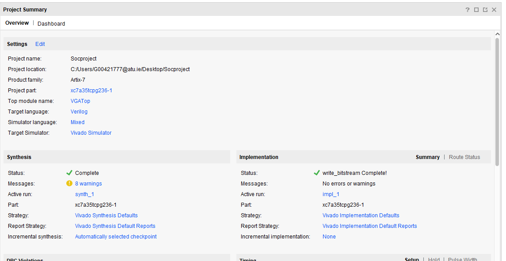

For my project, I created a slideshow that shows the Irish, Nigerian, and English national flags on a VGA monitor using Verilog. The design runs on a Basys3 FPGA and draws each flag before switching to the next.
## **Template VGA Design**
### **Project Set-Up**

## VGA Sync Module

