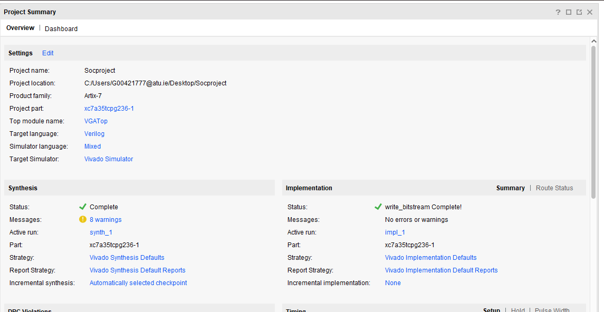
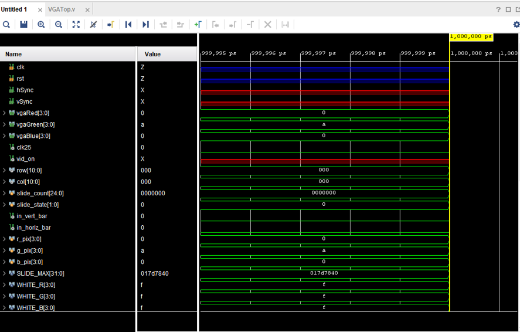
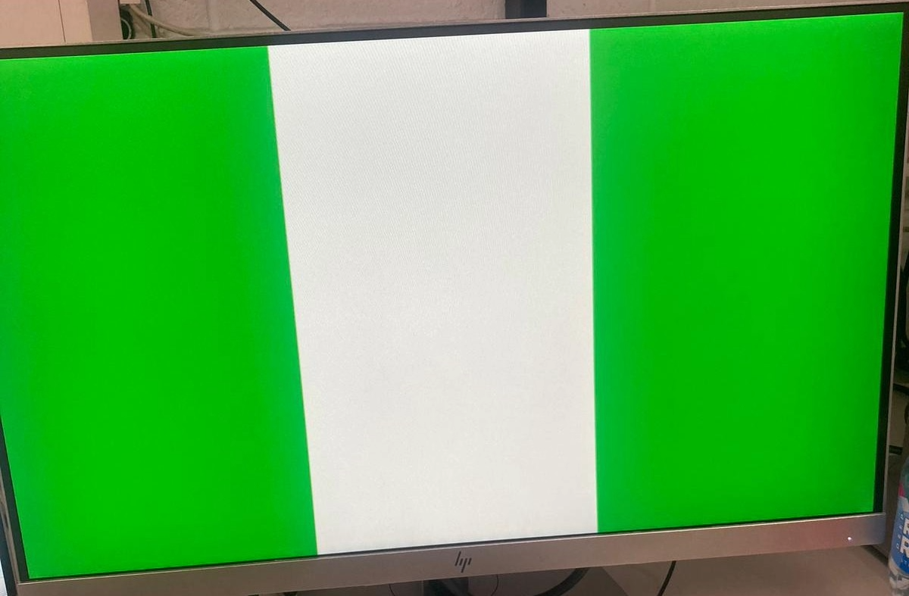
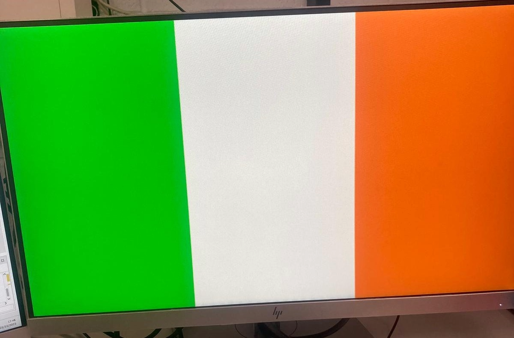
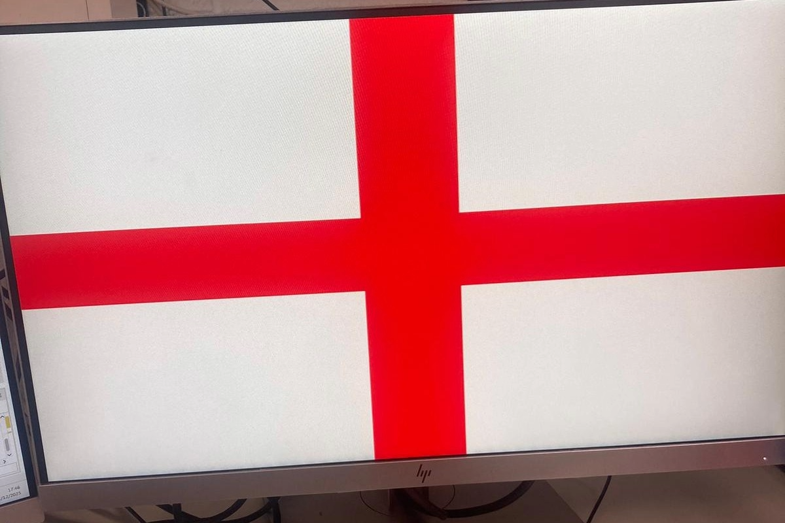

For my project, I created a slideshow that shows the Irish, Nigerian and English national flags on a VGA monitor using Verilog. The design runs on a Basys3 FPGA and draws each flag before switching to the next.
## **Template VGA Design**
### **Project Set-Up**
I created a new Vivado project, added all the provided Verilog source files (VGATop, VGASync, and the clock wizard), and applied the Basys3 constraints file. Vivado was then used to run simulation, synthesis, implementation, and bitstream generation in an FPGA design flow.

### **Template Code**
The project started with Verilog templates that handled the basic pipeline. VGASync.v generates the 640×480 VGA timing signals (hsync, vsync, vid_on ) and provides pixel coordinates (row, col). that determined when each frame began. VGATop.v connected the timing logic to a colour cycle module, which was used to test if the output worked. I altered the colour cycle module with code to display the Nigeria, Ireland and England flags in a timed slideshow
### **Simulation**
Before running the design on the board, I ran a behavioural simulation in Vivado to make sure the timing and slideshow logic were working correctly. I checked that row and col were counting properly, and seeing these signals behave as expected confirmed that the design was ready to be tested on the hardware.

### **Synthesis**
After the simulation, I ran the synthesis process, which converted my Verilog code into hardware and mapped it onto the Basys3 FPGA board. Both stages were completed with no timing issues, so I generated the bitstream and programmed the board. This allowed me to test the design on real hardware and confirm that the VGA slideshow worked correctly.
## **My VGA Design Edit**
For my design, I went with a slideshow of three national flags: Ireland, Nigeria and England. Each flag can be made using simple shapes, which works well with the VGA row and col coordinates system. I researched flag layouts for proportions to make the look correct on the display.

### **Code Adaptation**
Adapting the template code, I replaced the original colour-cycle module with my own drawing logic inside VGATop.I used the row and col values from the VGASync module to divide the screen into vertical or central regions (row and col), depending on the flag. For the slideshow effect, I added a counter and a state machine that switches flags every second. Each state selects a different set of colour rules, allowing the flags to appear one after another on the VGA monitor.
### **Demonstration**

After programming my board, the design displayed each flag on the VGA monitor as expected
